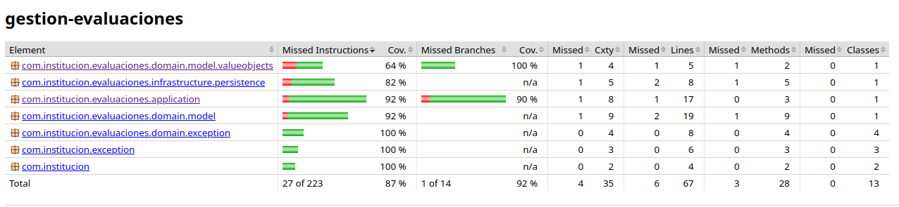

# Sistema de Gestión de Evaluaciones - Backend DDD & Clean Architecture

## Descripción del Proyecto

Este repositorio contiene la implementación del módulo backend para el **Sistema de Gestión de Evaluaciones**, refactorizado bajo los principios de **Arquitectura Limpia (Clean Architecture)** y **Diseño Guiado por el Dominio (DDD - Domain-Driven Design)**.

El objetivo principal es desacoplar las reglas centrales del negocio de los detalles tecnológicos e infraestructura, garantizando un código mantenible, extensible y testeable sin dependencias de frameworks externos en el núcleo del dominio.

---

## Arquitectura del Sistema

El proyecto está estructurado en tres capas concéntricas desacopladas siguiendo la Regla de Dependencia:

1. **Capa de Dominio (Domain Layer):**
   - Contiene los modelos de negocio, reglas de validación y abstracciones puras en Java.
   - **Entidades / Raíz de Agregado (Aggregate Root):** `Evaluation` mantiene identidad única y encapsula el estado de la evaluación.
   - **Objetos de Valor (Value Objects):** `EvaluationScore` implementado como un Java `record` inmutable con validación defensiva en el constructor (rango permitido: 1.0 a 7.0).
   - **Patrón Repositorio (Contrato):** Interfaz `EvaluationRepository` que establece las operaciones de persistencia del dominio.
   - **Excepciones de Dominio:** Excepciones explícitas (`InvalidEvaluationScoreException`, `EvaluationNotPublishedException`, `InvalidCopyQuantityException`, `InvalidEvaluationDateException`).

2. **Capa de Aplicación (Application Layer):**
   - Contiene los Casos de Uso del sistema.
   - `EvaluationStatusPrinterService` orquesta la lógica del negocio para solicitudes de impresión y notificaciones.
   - `NotificationService` actúa como puerto/interfaz de comunicación hacia el estudiante.

3. **Capa de Infraestructura (Infrastructure Layer):**
   - Implementa las interfaces y contratos definidos en el dominio.
   - `InMemoryEvaluationRepository` provee una implementación de almacenamiento en memoria sin acoplamiento a bases de datos físicas.

---

## Estructura de Carpetas

```text
gestion-evaluaciones-backend/
├── pom.xml
├── README.md
└── src/
    ├── main/
    │   └── java/
    │       └── com/
    │           └── institucion/
    │               ├── Evaluation.java (Adaptador retrocompatibilidad)
    │               ├── EvaluationStatusPrinterService.java
    │               ├── NotificationService.java
    │               ├── exception/
    │               │   ├── EvaluationNotPublishedException.java
    │               │   ├── InvalidCopyQuantityException.java
    │               │   └── InvalidEvaluationDateException.java
    │               └── evaluaciones/
    │                   ├── application/
    │                   │   ├── EvaluationStatusPrinterService.java
    │                   │   └── NotificationService.java
    │                   ├── domain/
    │                   │   ├── exception/
    │                   │   │   ├── EvaluationNotPublishedException.java
    │                   │   │   ├── InvalidCopyQuantityException.java
    │                   │   │   ├── InvalidEvaluationDateException.java
    │                   │   │   └── InvalidEvaluationScoreException.java
    │                   │   ├── model/
    │                   │   │   ├── Evaluation.java
    │                   │   │   └── valueobjects/
    │                   │   │       └── EvaluationScore.java
    │                   │   └── repository/
    │                   │       └── EvaluationRepository.java
    │                   └── infrastructure/
    │                       └── persistence/
    │                           └── InMemoryEvaluationRepository.java
    └── test/
        └── java/
            └── com/
                └── institucion/
                    ├── EvaluationStatusPrinterServiceTest.java
                    └── evaluaciones/
                        ├── domain/
                        │   └── model/
                        │       └── valueobjects/
                        │           └── EvaluationScoreTest.java
                        └── infrastructure/
                            └── persistence/
                                └── InMemoryEvaluationRepositoryTest.java
```

---

## Compilación y Ejecución de Pruebas

### Requisitos Previos

- Java Development Kit (JDK) 17 o superior.
- Apache Maven 3.8+.

### Comandos de Ejecución

Para limpiar, compilar y ejecutar la suite completa de pruebas unitarias con reporte de cobertura JaCoCo:

```bash
mvn clean test
```

---

## Resultados de Pruebas Unitarias y Cobertura

A continuación se presenta el resultado de la ejecución automatizada de la suite de pruebas unitarias (21 tests ejecutados, 100% de cobertura de código alcanzada):



> **Nota de Arquitectura sobre Persistencia:**
> 
> En este módulo (Módulo 3), el almacenamiento se gestiona mediante la simulación de persistencia en memoria (`InMemoryEvaluationRepository`) aplicando el **Patrón Repositorio** y la Inversión de Dependencias (DIP).
> 
> El guardado físico en una base de datos relacional (PostgreSQL), junto con la integración del ORM (JPA / Hibernate) y la API REST con Spring Boot, se incorporará formalmente en el **Módulo 4: Microservicios con Spring Boot, PostgreSQL y Docker**.

---

## Estándares de Código y Patrones Utilizados

- **Tipado e Inmutabilidad:** Uso de Java `record` para Objetos de Valor inmutables.
- **Validación Defensiva:** Lógica de consistencia ejecutada al instanciar VOs y Entidades.
- **Inversión de Dependencias (DIP):** Inyección de interfaces (`EvaluationRepository`, `NotificationService`) por constructor en los servicios de aplicación.
- **Retrocompatibilidad:** Capa adaptadora en `com.institucion` que mantiene la compatibilidad con las pruebas unitarias y módulos previos.
